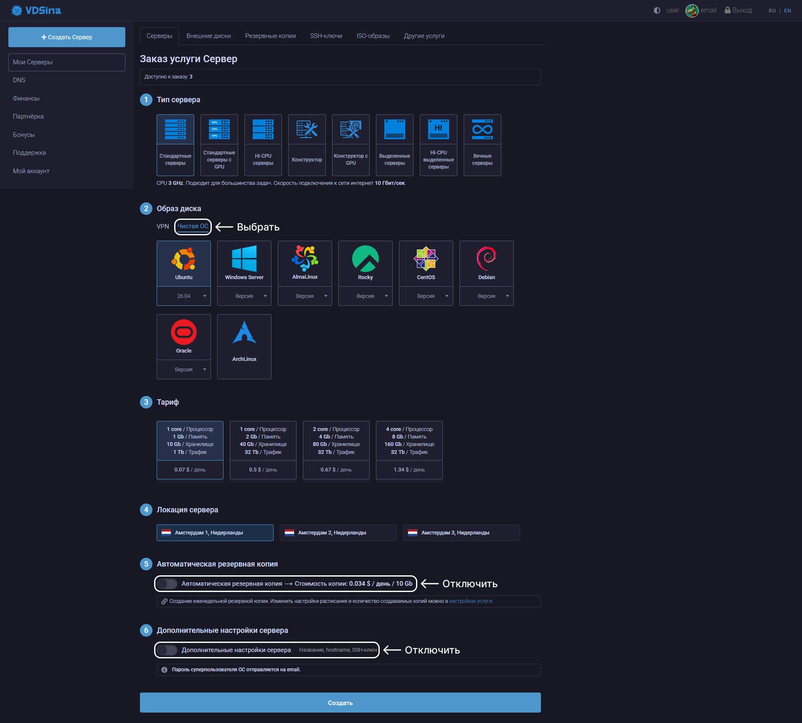
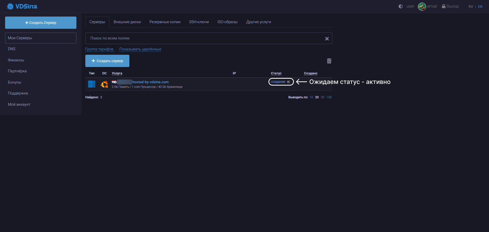
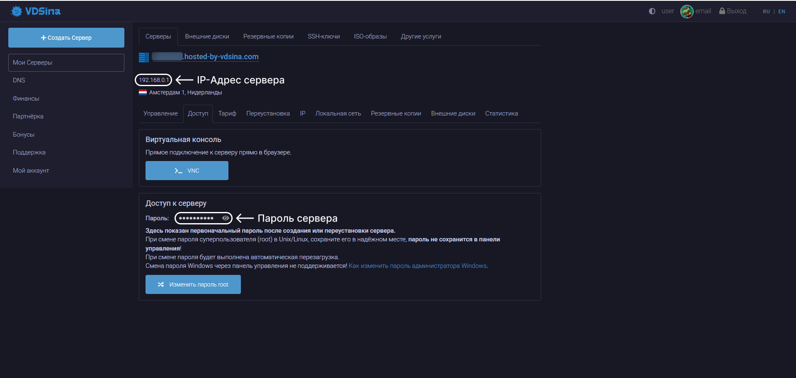

# Аренда сервера

В данном разделе описан процесс выбора хостинг-провайдера, аренды VPS/VDS-сервера.

Хостинг-провайдеры могут отличаться по интерфейсу, набору функций и дополнительным возможностям (например, резервное копирование, защита от DDoS, выбор дата-центра). Однако базовый функционал у большинства из них похож: выбор конфигурации сервера, установка операционной системы и управление ресурсами.

Ниже приведены примеры интерфейсов различных хостинг-провайдеров для наглядности. В целом, принцип работы у них одинаковый, поэтому можно ориентироваться на удобство и доступность сервиса.

Список актуальных хостингов и их статус будет обновляться отдельно.

Желательно брать сервер в той стране где происходят подключения.

 

## Содержание

- [1. Хостинги](#1-хостинги)
  - [1.1. VDSina](#11-vdsina)
  - [1.2. Список хостингов для аренды](#12-список-хостингов-для-аренды)

 

## 1. Хостинги

### 1.1. VDSina

После регистрации на платформе необходимо создать новый сервер. На этапе выбора конфигурации указывается тип сервера (в данном случае - чистая установка без предустановленных панелей или шаблонов).

На этом этапе можно сразу ознакомиться со стоимостью выбранной конфигурации и оценить будущие расходы.

После оплаты и создания сервера необходимо дождаться статуса `Активно` (или аналогичного), после чего сервер станет доступен для подключения. Время активации может варьироваться в зависимости от загруженности провайдера.

После активации откройте информацию о сервере - там будут указаны:

- IP-адрес сервера
- Пароль для подключения
- Дополнительные параметры доступа

### 1.2. Список хостингов для аренды

- <a href="https://vdsina.ru">VDSina</a>
- <a href="https://aeza.net/ru">AEZA</a>
- <a href="https://fornex.com/my/vps">Fornex</a>
