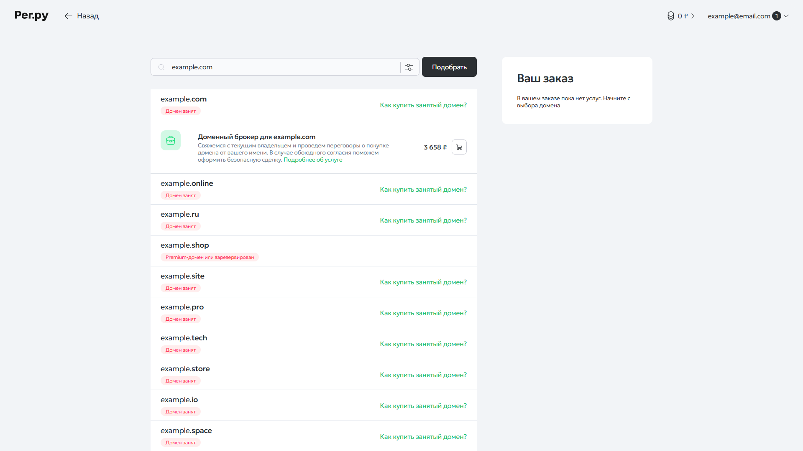
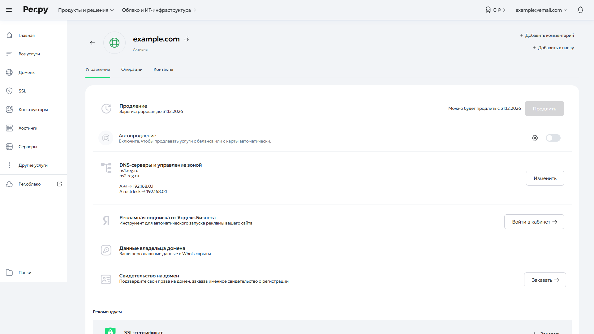
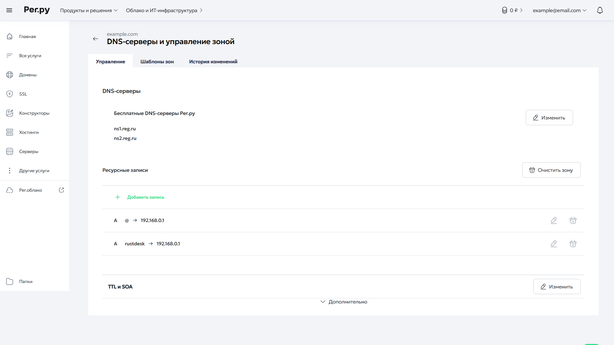
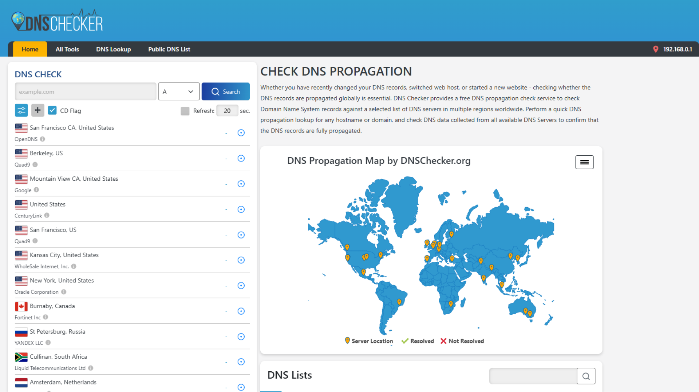

# Покупка домена

Для качественной настройки `RustDesk` необходимо приобрести доменное имя, для удобного использования смены серверов.

 

## Содержание

- [1. Что такое домен и зачем он нужен](#1-что-такое-домен-и-зачем-он-нужен)
- [2. Где купить домен](#2-где-купить-домен)
- [3. Как купить домен](#3-как-купить-домен)
- [4. Настройка DNS-записей домена](#4-настройка-dns-записей-домена)
- [5. Проверка корректности настройки](#5-проверка-корректности-настройки)

 

## 1. Что такое домен и зачем он нужен

Домен - это человеко читаемый адрес сервиса или сайта (например, example.ru). Он позволяет обращаться к серверу без использования IP-адреса.

 

## 2. Где купить домен

Домены приобретаются у специальных организаций - регистраторов доменных имён. После покупки домен закрепляется за владельцем на выбранный срок (обычно от 1 года) и может использоваться для сайтов, почты, панелей управления и других сервисов.

Популярные регистраторы:

- Reg.ru
- Beget
- Timeweb

В большинстве случаев процесс покупки, продления и настройки домена у разных регистраторов практически одинаков. Отличаются только интерфейс личного кабинета, способы оплаты и дополнительные услуги.

В качестве примера будет использоваться `Reg.ru`.

 

## 3. Как купить домен

Процесс покупки домена практически одинаков у всех регистраторов:

- Перейдите на сайт выбранного регистратора
- Введите желаемое доменное имя в строку поиска
- Выберите подходящую доменную зону (`.ru`, `.com`, `.site`, `.net` и др.)
- Убедитесь, что домен свободен для регистрации
- Добавьте домен в корзину
- Укажите данные владельца и выполните оплату
- После завершения регистрации домен появится в личном кабинете

Также стоит обратить внимание на дополнительные услуги регистратора. Многие компании предлагают услугу скрытия или защиты контактных данных владельца домена, что помогает уменьшить количество спама и повысить уровень конфиденциальности.

После покупки домена можно переходить к настройке DNS-записей и привязке домена к серверу.

 

## 4. Настройка DNS-записей домена

После покупки домена необходимо привязать его к серверу. Для этого используются DNS-записи, которые сообщают, на какой IP-адрес должен указывать домен.

В личном кабинете регистратора откройте список доменов, выберите нужный домен и перейдите в раздел `DNS-серверы и управление зоной`.

Если домен новый и не используется для других сервисов, рекомендуется удалить существующие ресурсные записи и создать следующие записи типа `A`:

| Тип | Имя        | Значение   |
| --- | ---------- | ---------- |
| `A` | `@`        | IP сервера |
| `A` | `rustdesk` | IP сервера |

Назначение записей:

- `@` - основной домен `example.com`
- `rustdesk` - используется для `UDP` подключения, и будет иметь адрес вида `rustdesk.example.com`

После создания записей сохраните изменения, и дождитесь когда произойдёт обновление DNS-записей. Это может занять от 15 минут до 24 часов, в зависимости от регистратора и DNS-кэша.

 

## 5. Проверка корректности настройки

После настройки DNS-записей рекомендуется убедиться, что изменения успешно применились и домен указывает на нужный сервер.

Для проверки можно воспользоваться сервисом <a href="https://dnschecker.org/">DNS Checker</a>.

В поле поиска введите ваш домен, выберите тип записи `A` и запустите проверку.

Если настройка выполнена корректно, в результатах будет отображаться IP-адрес вашего сервера. Проверка выполняется через DNS-серверы из разных стран, поэтому обновление может происходить постепенно.

Если вместо вашего IP отображаются старые значения или записи отсутствуют:

- Убедитесь, что DNS-записи сохранены у регистратора
- Проверьте правильность указанного IP-адреса
- Подождите некоторое время для обновления DNS-кэша
- Повторите проверку позже
