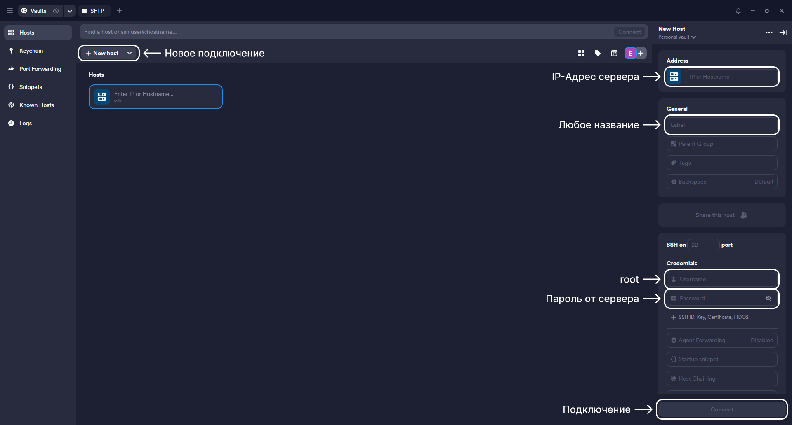
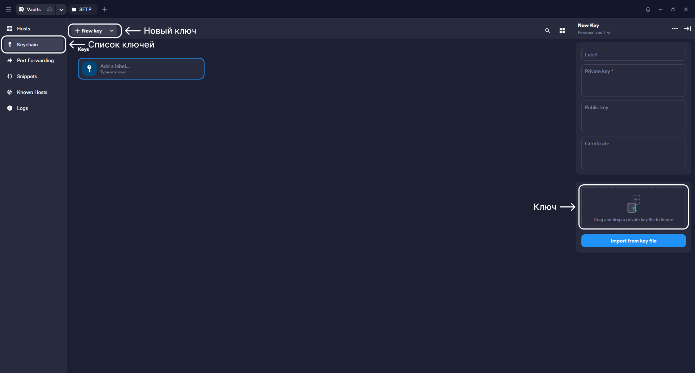
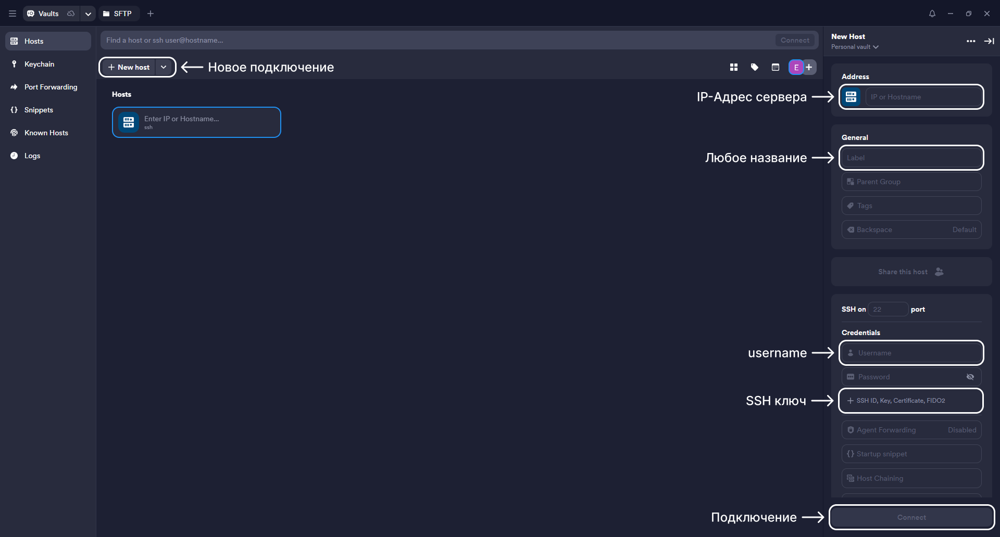
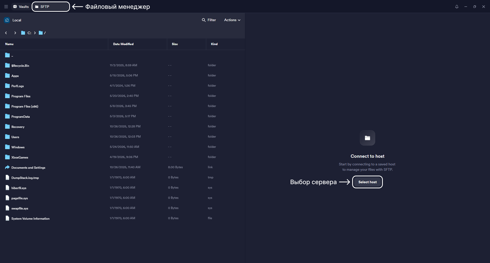
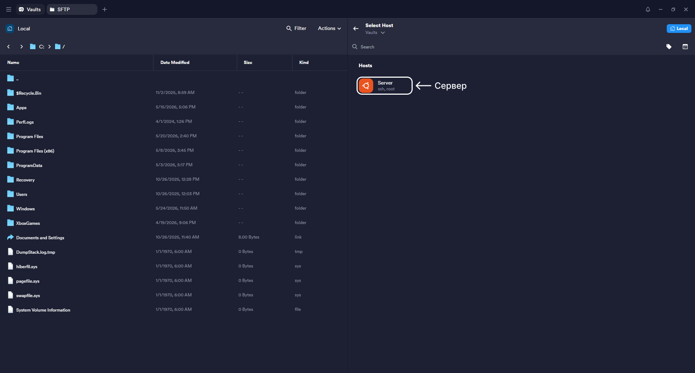
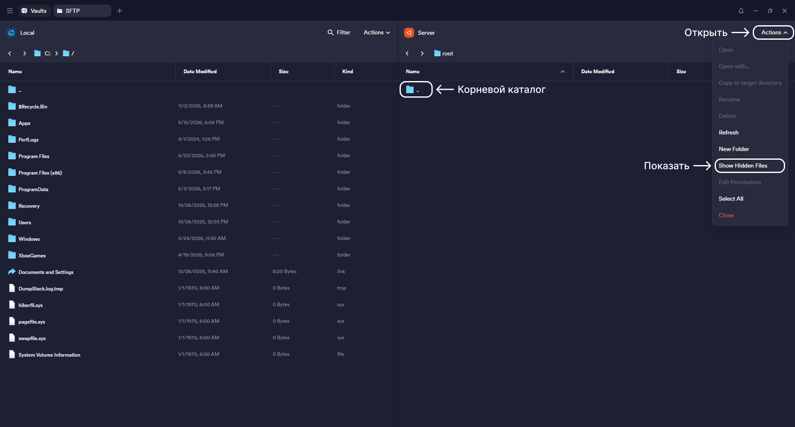
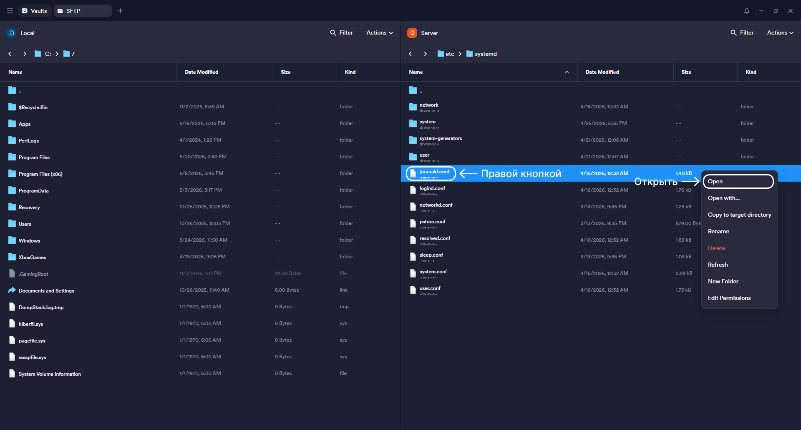
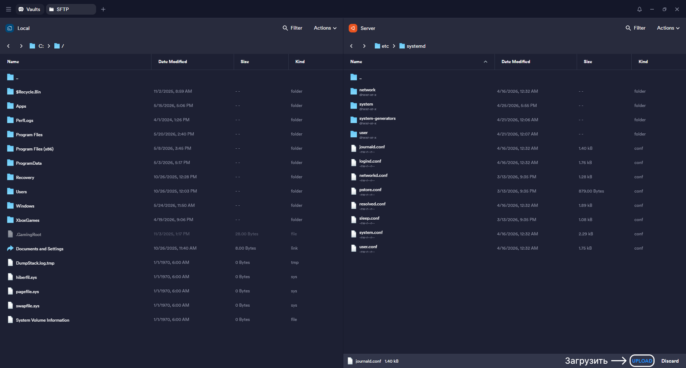

# Настройка Termius

Termius - это современный SSH-клиент, предназначенный для удобного подключения к удалённым серверам. Он обладает интуитивно понятным интерфейсом и рядом полезных функций:

- Удобный и понятный интерфейс с визуальным управлением подключениями
- Возможность передачи файлов между компьютером и сервером
- Поддержка SSH-ключей и безопасное хранение данных
- Синхронизация настроек между устройствами через аккаунт

<br />

## Содержание

- [1. Установка](#1-установка)
- [2. Первое подключение к серверу](#2-первое-подключение-к-серверу)
- [3. Подключение к серверу по SSH ключу](#3-подключение-к-серверу-по-ssh-ключу)
- [4. Настройка SFTP](#4-настройка-sftp)
- [5. Открытие и редактирование файлов](#5-открытие-и-редактирование-файлов)
- [6. Прочее](#6-прочее)

<br />

## 1. Установка

- Перейдите на официальный сайт: <a href="https://termius.com">Termius</a>
- Создайте бесплатный аккаунт или войдите, если он уже уже существует
- Скачайте приложение для своей операционной системы (Windows / macOS / Linux)
- Установите и запустите Termius
- После установки выполните вход в свой аккаунт

<br />

## 2. Первое подключение к серверу

При первом подключении к серверу необходимо ввести данные, полученные от хостинг-провайдера, включая IP-адрес и данные для авторизации.

- В главном окне Termius нажмите `New Host` (Новое подключение)
- `Address` (Хост / IP) - IP-адрес сервера
- `Label` (Название) - любое удобное имя подключения
- `Username` (Имя пользователя) - имя пользователя для входа (по умолчанию при первом входе это `root`)
- `Password` (Пароль) - пароль пользователя (либо SSH-ключ, если он настроен)
- `Connect` - подключение к серверу. Все введённые данные сохраняются, и в дальнейшем вход выполняется в один клик



Если данные введены корректно - откроется терминал сервера.


Теперь можно работать с сервером напрямую через Termius. Программа сохранит подключение, и при следующем запуске достаточно будет просто выбрать сохранённый хост.

Для повышения безопасности рекомендуется настроить подключение по SSH-ключам и ограничить или отключить вход под пользователем `root`. Подробная информация по этому шагу находится здесь: [🧩 Настройка Linux Ubuntu сервера](../6-LINUX-UBUNTU-SETTINGS/README.md). Перед этим рекомендуется ознакомиться с остальными разделами руководства и только затем переходить к настройке сервера.

<br />

## 3. Подключение к серверу по SSH ключу

Если на сервере настроено подключение по SSH-ключу, рекомендуется использовать именно этот способ вместо входа под `root`, так как он обеспечивает более высокий уровень безопасности.

- В панели слева выберите раздел `Keychain`
- Нажмите кнопку добавления нового ключа
- Либо введите данные вручную в правой части экрана, либо перетащите готовый файл ключа



Далее в разделе `Host` можно либо создать новое подключение, как в предыдущем пункте, либо отредактировать уже существующее. Вместо пароля выберите использование `Key` и укажите созданный SSH-ключ.



При первом подключении может потребоваться пароль пользователя - он задаётся при создании пользователя на сервере.

Если все настройки выполнены корректно, откроется консоль сервера, и подключение будет установлено.

<br />

## 4. Настройка SFTP

`SFTP` подключение необходимо для копирования или вставки файлов - менеджер файлов. И его также нужно настроить для удобства.

Для начала просто выбираем вкладку `SFTP`:



Выбираем сервер и подключаемся:



При подключении появиться стандартный каталог. Далее кликаем на `Actions` и включаем отображение скрытых папок и файлов, потом это пригодиться.



<br />

# 5. Открытие и редактирование файлов

В Termius встроен SFTP-интерфейс, который позволяет просматривать, открывать и редактировать файлы на сервере напрямую, без необходимости ручной загрузки и повторной отправки.

Для открытия файла в SFTP-панели необходимо найти нужный файл, нажать по нему правой кнопкой мыши (или открыть контекстное меню) и выбрать пункт `Open`. После этого появится выбор способа открытия файла: можно использовать стандартный текстовый редактор системы (например, блокнот на Windows) либо другое установленное приложение для редактирования текста.



После открытия файл можно изменить и сохранить как обычный документ на компьютере.

После сохранения изменений Termius автоматически обнаружит, что файл был изменён, и предложит обновить его на сервере. Для применения изменений достаточно подтвердить замену файла - после этого обновлённая версия будет загружена на сервер.



Важно учитывать, что некоторые системные настройки и конфигурационные файлы могут требовать прав пользователя `root`. Поэтому такие изменения рекомендуется выполнять заранее от имени администратора сервера, иначе доступ к замене или сохранению файлов может быть ограничен.

<br />

# 6. Прочее

В программе Termius не работает стандартное сочетание клавиш `ctrl+c` и `ctrl+v`, к нему добавляется shift: `ctrl+shift+c` и `ctrl+shift+v`.

Очистка консоли командой:

```bash
clear
```
