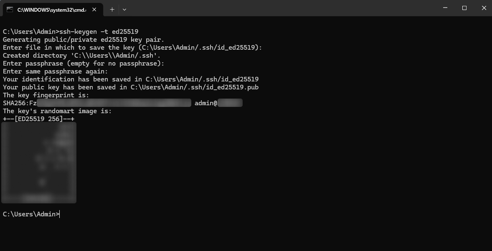

# Настройка Linux Ubuntu сервера

В данной главе описаны основные шаги первичной настройки сервера на Linux Ubuntu, включая базовую подготовку системы, настройку SSH-подключений, управление пользователями и параметры логирования.

<br />

## Содержание

- [1. Обновление системы](#1-обновление-системы)
- [2. Настройка системы пользователей](#2-настройка-системы-пользователей)
  - [2.1. Настройка SSH](#21-настройка-ssh)
  - [2.2. Настройка брандмауэра (UFW)](#22-настройка-брандмауэра-ufw)
  - [2.3. Создание и настройка нового пользователя](#23-создание-и-настройка-нового-пользователя)
  - [2.4. Настройка SSH-ключей - клиент](#24-настройка-ssh-ключей---клиент)
  - [2.5. Настройка SSH-ключей - сервер](#25-настройка-ssh-ключей---сервер)
  - [2.6. Отключение пароля и root пользователя](#26-отключение-пароля-и-root-пользователя)
- [3. Настройка даты и времени](#3-настройка-даты-и-времени)
- [4. Ограничение логирование системы до 3-х дней](#4-ограничение-логирование-системы-до-3-х-дней)

<br />

## 1. Обновление системы

Перед началом настройки необходимо убедиться, что сервер обновлён до последней актуальной версии. В процессе обновления система может установить новые пакеты и в завершение выполнить перезагрузку сервера:

```bash
sudo apt update && sudo apt upgrade -y && reboot
```

<br />

## 2. Настройка системы пользователей

Действия описанные в данном пункте не обязательны, но помогут существенно повысить безопасность сервера.

Для безопасного подключения к серверу не рекомендуется использовать пользователя `root`. Он имеет полный доступ к системе, и любая ошибка может привести к серьёзным последствиям.

### 2.1. Настройка SSH

Проверка работы `SSH`:

```bash
systemctl status ssh
```

Если `SSH` работает, вы увидите статус: `Active: active (running)`, тогда можно перейти к [пункту 2.2.](#22-настройка-брандмауэра-ufw)

Если `SSH` не установлен: `inactive` или `not found`, устанавливаем `SSH`:

```bash
sudo apt install openssh-server -y
```

После установки включаем и запускаем сервис:

```bash
sudo systemctl enable ssh
sudo systemctl start ssh
```

Снова проверка:

```bash
systemctl status ssh
```

### 2.2. Настройка брандмауэра (UFW)

Включение базовой защиты, разрешаем SSH-доступ:

```bash
sudo ufw allow OpenSSH
```

Выводиться: `Rules updated и Rules updated (v6)`

Включаем `firewall`:

```bash
sudo ufw enable
```

Спросит: `Command may disrupt existing ssh connections. Proceed with operation (y|n)?` - ответ: `y`

Проверка статуса:

```bash
sudo ufw status
```

Ожидаемый результат: `Status: active`

Открытие портов (используются для подключения к системе):

```bash
sudo ufw allow 80/tcp
sudo ufw allow 21115/tcp
sudo ufw allow 21116/udp
sudo ufw allow 21117/tcp
sudo ufw allow 21118/tcp
sudo ufw allow 21119/tcp
```

### 2.3. Создание и настройка нового пользователя

Для более безопасной работы с сервером рекомендуется использовать не `root`, а отдельного пользователя с правами `sudo`.

Создание нового пользователя (замените `username` на желаемое имя):

```bash
sudo adduser username
```

После выполнения команды система создаст пользователя и предложит установить пароль. Пароль вводится дважды и должен быть сохранён в надёжном месте.

Дополнительную информацию о пользователе (например, имя, телефон и т.д.) можно указать по желанию или пропустить, нажимая `Enter`.

Добавление пользователя в группу `sudo` (предоставляет права администратора):

```bash
sudo usermod -aG sudo username
```

Проверка прав пользователя (в выводе должна присутствовать группа `sudo`):

```bash
sudo groups username
```

### 2.4. Настройка SSH-ключей - клиент

Данные действия выполняются по желанию.

SSH-ключ используется для входа на сервер без ввода пароля и является более надёжным способом аутентификации. На локальном компьютере (не на сервере) необходимо сгенерировать SSH-ключ. Откройте командную строку и выполните команду:

```bash
ssh-keygen -t ed25519
```

После запуска система задаст несколько вопросов:

`Enter file in which to save the key` - путь для сохранения ключа. Можно указать собственный путь или нажать `Enter`, чтобы использовать путь по умолчанию. Например: `(C:\Users\Admin/.ssh/id_ed25519)`.

`Enter passphrase` - дополнительный пароль для защиты приватного ключа. Если задать passphrase, он будет запрашиваться при каждом подключении по SSH. Если оставить поле пустым, подключение будет выполняться автоматически без дополнительного запроса.

`Enter same passphrase again` - повтор ввода пароля (если он задавался). Если passphrase не используется, просто нажмите `Enter`.

После завершения будут созданы два файла: `id_ed25519` (приватный ключ) и `id_ed25519.pub` (публичный ключ), которые обычно располагаются в папке `~/.ssh/.` Их необходимо хранить в безопасном месте и не передавать третьим лицам.

Пример созданного ключа:



Приватный ключ id_ed25519 необходимо добавить в Termius в раздел ключей. Подробная информация по использованию SSH-ключей доступна здесь: [Подключение к серверу по SSH ключу](/TERMIUS/README.md#3-подключение-к-серверу-по-ssh-ключу).

### 2.5. Настройка SSH-ключей - сервер

Выполняется только в том случае, если ранее был создан SSH-ключ на клиентской стороне.

На сервере под пользователем `root` необходимо создать директорию для SSH-ключей нового пользователя и задать корректные права доступа (замените `username` на фактическое имя пользователя):

```bash
mkdir -p /home/username/.ssh
```

```bash
chown -R username:username /home/username/.ssh
```

```bash
chmod 700 /home/username/.ssh
```

Далее необходимо перенести публичный ключ `id_ed25519.pub` на сервер. Файл загружается через `SFTP` в директорию пользователя, по пути: `/home/username/.ssh`.

Если папка `.ssh` не отображается, включите отображение скрытых файлов в файловом менеджере.

После загрузки ключа выполните вход под созданным пользователем:

```bash
su - username
```

Затем настройте права доступа и добавьте ключ в список авторизованных:

```bash
chmod 700 ~/.ssh
```

```bash
cat ~/.ssh/id_ed25519.pub >> ~/.ssh/authorized_keys
```

```bash
chmod 600 ~/.ssh/authorized_keys
```

```bash
rm ~/.ssh/id_ed25519.pub
```

После выполнения этих шагов подключение по SSH-ключу будет доступно для данного пользователя.

### 2.6. Отключение пароля и root пользователя

Данный шаг выполняется только в том случае, если уже настроен вход на сервер через отдельного пользователя по SSH-ключу.

⚠️ ВНИМАНИЕ: Перед отключением доступа `root` рекомендуется сначала выполнить пункты:

- [3. Настройка даты и времени](#3-настройка-даты-и-времени)
- [4. Ограничение логирование системы до 3-х дней](#4-ограничение-логирование-системы-до-3-х-дней)

⚠️ Будьте особенно осторожны при отключении `root` и входа по паролю. После этого вход под `root` будет невозможен, а все дальнейшие изменения системы придётся выполнять через пользователя с правами `sudo`.

Если нет необходимости полностью отключать `root`, можно ограничиться использованием SSH-ключей для входа - это уже значительно повышает уровень безопасности, хотя не исключает риски полностью.

Подключитесь к серверу под созданным пользователем (например, `username`) и откройте конфигурационный файл `SSH`:

```bash
sudo nano /etc/ssh/sshd_config
```

Файл откроется в текстовом редакторе внутри терминала. Редактирование системных файлов выполняется именно через консоль, так как требуется доступ с правами `sudo`.

Отключение root-доступа. Найдите строку: `PermitRootLogin yes` и заменяем на:

```bash
PermitRootLogin no
```

Отключение входа по паролю. Найдите строку: `#PasswordAuthentication yes` и замените на:

```bash
PasswordAuthentication no
```

Для сохранения изменений используйте комбинацию клавиш: `ctrl+x`, `y`, `Enter`. После внесения изменений необходимо перезапустить SSH-службу:

```bash
sudo systemctl restart ssh
```

<br />

## 3. Настройка даты и времени

Перед началом настройки рекомендуется проверить текущие параметры времени и часового пояса:

```bash
timedatectl
```

Для установки часового пояса (например, Московского) используйте команду:

```bash
sudo timedatectl set-timezone Europe/Moscow
```

В некоторых случаях может потребоваться задать время вручную:

```bash
sudo timedatectl set-time '2026-12-31 23:59:59'
```

После выполнения настроек система автоматически применит изменения.

<br />

## 4. Ограничение логирование системы до 3-х дней

Система Linux автоматически ведёт журнал событий, фиксируя все действия и процессы. Со временем эти данные могут занимать значительный объём диска, поэтому рекомендуется ограничивать срок хранения логов.

Проверка текущего объёма логов:

```bash
journalctl --disk-usage
```

Очистка логов с сохранением последних 3 дней. Удаляет устаревшие записи и оставляет только данные за последние 3 дня:

```bash
sudo journalctl --vacuum-time=3d
```

Чтобы система автоматически не накапливала старые журналы, необходимо изменить конфигурационный файл.

Откройте файл через `SFTP` (см. информацию: [🔑 Настройка Termius](../5-TERMIUS/README.md)). Путь к файлу: `/etc/systemd/journald.conf`. Найдите строку: `#MaxRetentionSec=` и замените на:

```bash
MaxRetentionSec=3day
```

Сохраните файл и закройте редактор. После этого Termius предложит обновить файл на сервере - подтвердите замену. Перезапустите службу журналирования:

```bash
sudo systemctl restart systemd-journald
```

Для полной уверенности в применении настроек рекомендуется перезагрузить сервер после выполнения всех изменений.
