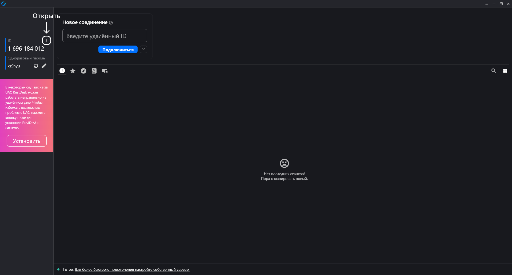
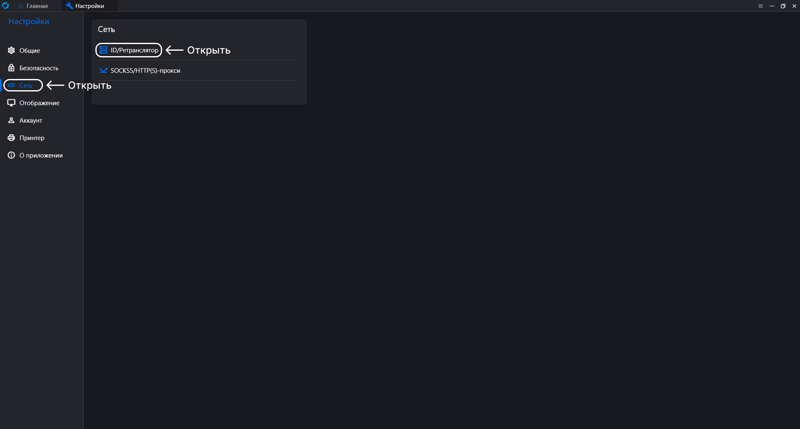
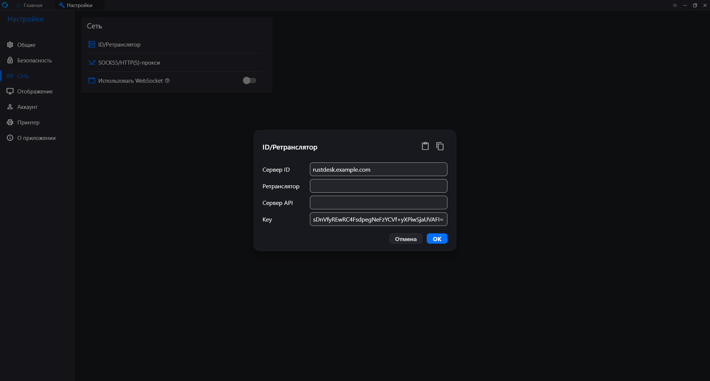

# Установка и настройка RustDesk

Настройка серверной и клиентской части системы, для удалённого подключения.

## Содержание

- [1. Установка на сервер](#1-установка-на-сервер)
- [2. Получение ключа](#2-получение-ключа)
- [3. Подключение клиента](#3-подключение-клиента)
- [4. Настройка службы в Windows (дополнительно)](#4-настройка-службы-в-windows-дополнительно)
  - [4.1. Установка](#41-установка)
  - [4.2. Удаление](#42-удаление)
- [5. Бэкап системы](#5-бэкап-системы)
  - [5.1. Создание копии](#51-создание-копии)
  - [5.2 Восстановление на новом сервере](#52-восстановление-на-новом-сервере)
  - [5.3. Запуск контейнера](#53-запуск-контейнера)
- [6. Обновление системы](#6-обновление-системы)

<br />

## 1. Установка на сервер

Система `RustDesk` будет запускаться в `Docker` контейнерах. Такой способ упрощает обновление, перенос на другой сервер, резервное копирование и восстановление конфигурации.

Используемая версия системы: `1.1.15`.

Создайте рабочую директорию и перейдите в неё:

```bash
mkdir rustdesk && cd rustdesk
```

Создайте файл конфигурации `Docker Compose`:

```bash
nano docker-compose.yml
```

Вставьте следующее содержимое (в commands подставьте реальный домен):

```bash
services:
  hbbs:
    container_name: hbbs
    image: rustdesk/rustdesk-server:latest
    command: hbbs -r rustdesk.example.com:21117
    volumes:
      - ./data:/root
    network_mode: host
    restart: unless-stopped

  hbbr:
    container_name: hbbr
    image: rustdesk/rustdesk-server:latest
    command: hbbr
    volumes:
      - ./data:/root
    network_mode: host
    restart: unless-stopped
```

Описание основных параметров:

- `image` - образ RustDesk. Значение latest означает использование последней доступной версии (используемая версия в инструкции `1.1.15`).
- `volumes` - каталоги для хранения ключа вне контейнера
- `network_mode: host` - контейнер использует сетевой интерфейс сервера напрямую, что упрощает работу с сетевыми протоколами Xray
- `restart: unless-stopped` - автоматически запускает контейнер после перезагрузки сервера

Сохраните файл сочетанием клавиш: `ctrl+x`, `y`, `Enter`.

После сохранения запустите контейнер:

```bash
docker compose up -d
```

Проверить успешный запуск контейнера можно командой:

```bash
docker ps
```

Если контейнеры отображается в списке и имеет статус Up, установка выполнена успешно.

<br />

## 2. Получение ключа

Сервер генерирует публичный ключ, который необходим клиентам для шифрования соединения. Выполните команду:

```bash
cat ./data/id_ed25519.pub
```

Скопируйте полученную строку, но только определённую часть. Например: `8UIsDnVfyREwRC4FsdpegNeFzYCVf+yXPiwSjaUVAFI=`.

Сохраните ключ, он нужен будет для подключения между устройствами, но храните его в безопасности.

<br />

## 3. Подключение клиента

Скачайте официальный клиент (рекомендуется версия `1.4.7` и выше) с <a href="https://github.com/rustdesk/rustdesk/releases/tag/1.4.7">Github</a> проекта.

После запуска приложения откройте меню настроек, нажав кнопку с тремя точками рядом с идентификатором устройства (ID).



В открывшемся окне перейдите в раздел: `Сеть → ID/Ретранслятор`



Заполните следующие поля:

| Параметр  | Значение                      |
| --------- | ----------------------------- |
| Сервер ID | Доменное имя сервера RustDesk |
| Key       | Публичный ключ сервера        |

Пример:

```text
Сервер ID: rustdesk.example.com
Key: 8UIsDnVfyREwRC4FsdpegNeFzYCVf+yXPiwSjaUVAFI=
```

После заполнения параметров нажмите `Ок`.



Перейдите на вкладку Главная, и если если настройка выполнена корректно, в нижней части окна будет отображаться статус: `Готов`. Это означает, что клиент успешно подключён к серверу и готов к работе.

Если отображается статус: `Служба не запущена`, нажмите кнопку `Запустить службу`.

После запуска служба может инициализироваться в течение нескольких минут. По завершении статус должен измениться на `Готов`.


В случае если пишет `Служба не запущена` нажимаем на `Запустить службу`. Программа может перезапуститься. При загрузке может занять 1-2 минуты прежде чем напишет `Готов`.

<br />

## 4. Настройка службы в Windows (дополнительно)

### 4.1. Установка

Для установки службы в случае, когда необходимо обеспечить работу RustDesk до входа пользователя в систему Windows.

Откройте командную строку от имени администратора и выполните команду:

```bash
sc create RustDesk binPath= "\"C:\Program Files\RustDesk\rustdesk.exe\" --service"
```

После создания службы её можно запустить через оснастку `Службы` (`services.msc`) или перезагрузить компьютер.

### 4.2. Удаление

Если требуется удалить службу RustDesk:

1. Откройте оснастку `Службы` (`services.msc`).
2. Найдите службу `RustDesk Service`.
3. Остановите службу.
4. Выполните команду от имени администратора:

```bash
sc delete RustDesk
```

После выполнения команды служба будет удалена из системы.

## 5. Бэкап системы

### 5.1. Создание копии

Чтобы не потерять настройки системы и ключей, рекомендуется регулярно делать резервную копию (backup).

На сервере переходим в папку с системой:

```bash
cd rustdesk
```

Создаём архив со всеми файлами, настройками, базами данных (может потребоваться пароль пользователя):

```bash
sudo tar -czvf rd-backup.tar.gz ./
```

В архив попадут:

- Настройки системы
- Ключи ssh
- Конфигурационные файлы Docker

Полученный файл: `rd-backup.tar.gz`, необходимо скачать на локальный компьютер через `SFTP` и хранить в безопасном месте.

### 5.2 Восстановление на новом сервере

Если сервер был заменён или перестал работать, настраиваем сервер также как ранее, но вместо установки rustdesk с нуля, с помощью `SFTP` также копируем файл `rd-backup.tar.gz` на сервер, и распаковываем архив:

```bash
sudo tar -xzvf rd-backup.tar.gz
```

После распаковки восстановятся все настройки и ключи системы. Но перед запуском контейнера необходимо сделать:

- Обновить `IP-адрес` у домена в `DNS-записях`
- Дождаться обновления `DNS` (может занять до 24 часов)
- Убедиться, что домен указывает на новый сервер

### 5.3. Запуск контейнера

После восстановления запускаем контейнер:

```bash
docker compose up -d
```

При правильном восстановлении:

- Все клиенты сохраняются
- Подключения продолжают работать
- Ключи остаются валидными

<br />

## 6. Обновление системы

Серверная системы `RustDesk` может периодически обновляется: добавляются новые функции, исправлятся ошибки и улучшаться стабильность.

Перед обновлением обязательно:

- Сделать полный бэкап системы (см. [раздел 5](#5-бэкап-системы))
- Убедиться, что у вас есть доступ к серверу через SSH

Переходим в папку:

```bash
cd rustdesk
```

Открываем файл конфигурации и проверяем строку: `image: rustdesk/rustdesk-server:latest` в двух местах (hbbr и hbbs):

```bash
nano docker-compose.yml
```

Если стоит `latest` → будет использоваться последняя доступная версия. Если указана конкретная версия → обновление будет зафиксировано на ней. Изменять версию стоит только если вы понимаете, что делаете.

После изменений сохраняем файл сочетанием клавиш: `ctrl+x`, `y`, `Enter`, и выполняем обновление образа:

```bash
docker compose pull
```

Далее перезапускаем контейнер:

```bash
docker compose up -d
```

После запуска проверяем доступность клиентов и подключений убеждаемся, что всё работает корректно.

Если после обновления подключение не работает, восстановите систему из копии либо откатитесь на предыдущую стабильную версию образа.

Обновление - не обязательная процедура. Если система работает стабильно лучше ничего не трогать.
