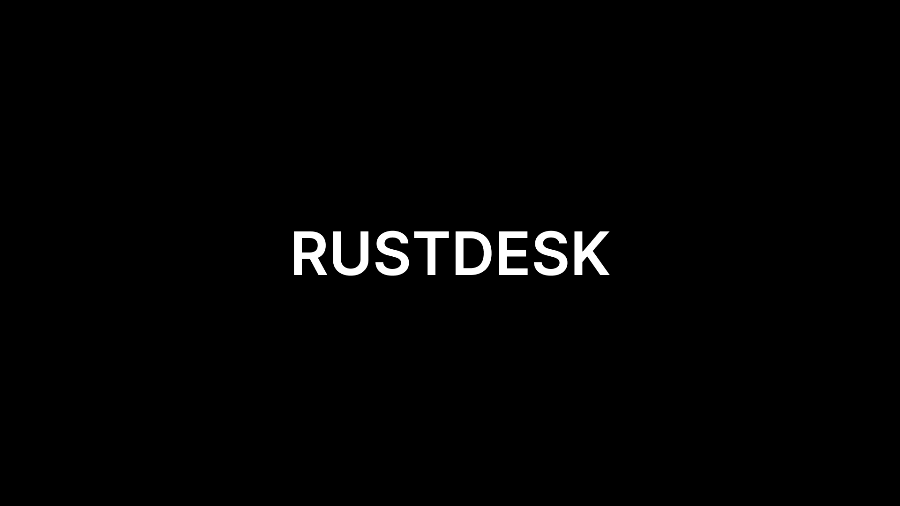

# Server RustDesk

> Версия: 3.0.1

 

> Инструкция по развертыванию персональной системы удаленного доступа на базе программного обеспечения RustDesk.

 

## 📖 Основная информация

- [📘 Описание](./1-DESCRIPTION/README.md)

## 🖥️ Работа с сервером и программами

- [💰 Аренда сервера](./2-PURCHASE-SERVERS/README.md)
- [💲 Покупка домена](./3-BUYING-DOMAIN/README.md)
- [🔑 Настройка Termius](./4-TERMIUS/README.md)
- [🧩 Настройка Linux Ubuntu сервера](./5-LINUX-UBUNTU-SETTINGS/README.md)
- [⚙️ Установка сервисов на сервер](./6-SERVICES-SERVER/README.md)

## 🔐 Сервис и настройка

- [🪟 Настройка программы RustDesk](./7-RUSTDESK-SETTINGS/README.md)
